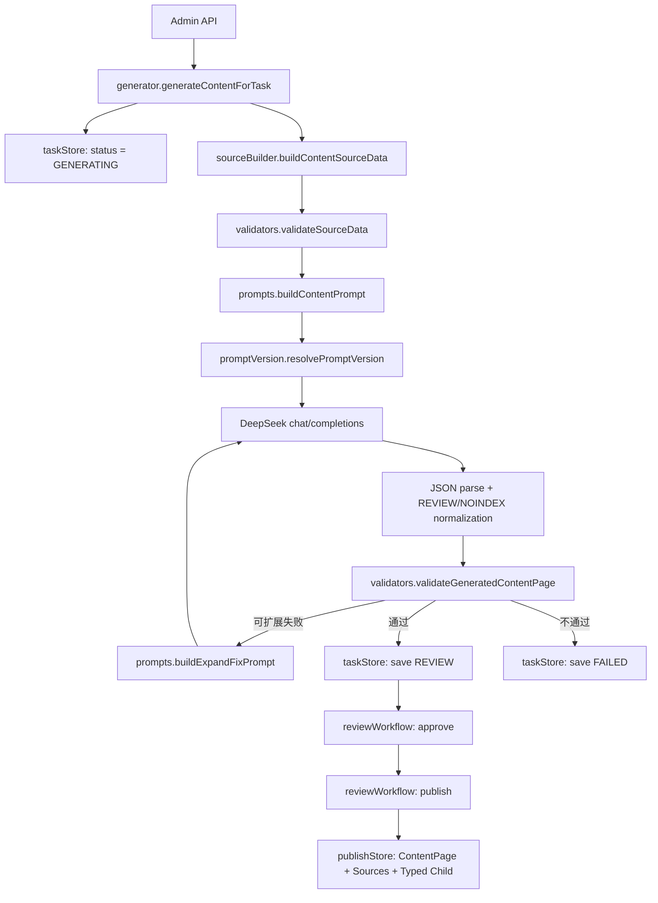

# Content Generation 源码分析报告

> 分析范围：`nuxt3-webAll/server/services/contentGeneration`、`nuxt3-webAll/server/api/admin/content-generation` 以及相关 Prisma 模型。  
> 分析方式：基于当前工作区源码静态分析。本文只提取职责、数据契约、调用关系和关键逻辑，不复制完整源码。  
> 行数统计口径：PowerShell `Get-Content` 返回的物理行数，包含空行和注释。

## 一、总体结论

当前 content-generation 是一个“统一任务模型 + 统一生成编排器 + 两个内容族分支”的后台生成系统。它没有使用类，也没有为 Guide 和 Compare 建立两个完全独立的 Generator 对象；真正的执行入口只有 `generateContentForTask()`。Guide 与 Compare 的差异主要由 `sourceData.task`、`contentPage.type`、Prompt Builder 分支和 Validator 分支表达。

当前真实支持的生成族如下：

- Guide 族：`BUYER_GUIDE`、`CATEGORY_GUIDE`、`TUTORIAL`。
- Compare 族：`COMPARISON`、`ALTERNATIVE`。

主流程是：管理员创建任务，API 调用统一生成器，Source Builder 从 Prisma 加载分类和工具，Prompt Builder 根据 source task 选择 Guide 或 Compare Prompt，Prompt Version 绑定数据库版本，DeepSeek Client 发起请求，Validator 对结构和生产质量进行检查，最后 Task Store 将结果保存为 `REVIEW` 或 `FAILED`。审核通过后，Review Workflow 才允许 Publish Store 写入正式 `ContentPage`。

该系统具有较清晰的任务状态机和审计字段，但源码职责仍有明显集中：`generator.js` 同时承担 AI Client、重试、解析、扩展修复和编排；`validators.js` 同时承担 schema、内容指标、SEO、安全、来源和工具事实校验；`sourceBuilder.js` 同时承担数据库查询、工具选择、字段映射和内容族 source schema 构造。当前没有正式 JSON Schema 或类型注册中心，Prompt 中的 shape 示例、Validator 和 Publish Store 可能发生漂移。

## 二、端到端调用关系



Guide 和 Compare 共用 `generator.js`、DeepSeek 调用、Prompt Version、任务存储和审核流程。它们在 Source Builder、Prompt Builder、Editorial Rules 和 Validator 内部通过条件分支区分。

## 三、核心文件规模总览

| 文件 | 行数 | 核心角色 |
|---|---:|---|
| `server/services/contentGeneration/generator.js` | 268 | 统一生成编排器与 DeepSeek Client |
| `server/services/contentGeneration/prompts.js` | 317 | Guide/Compare Prompt Builder 与工具上下文压缩 |
| `server/services/contentGeneration/editorialRules.js` | 228 | 共享、Guide、Compare 编辑规则和质量阈值 |
| `server/services/contentGeneration/sourceBuilder.js` | 318 | Sources、工具查询、工具选择和 sourceData 构造 |
| `server/services/contentGeneration/validators.js` | 463 | 输入校验、Response 校验、质量指标和事实校验 |
| `server/services/contentGeneration/promptVersion.js` | 88 | Prompt Version 选择、创建和任务绑定 |
| `server/services/contentGeneration/taskStore.js` | 550 | 任务数据库读写、状态机、生成结果和事件日志 |
| `server/services/contentGeneration/publishStore.js` | 179 | 正式内容数据库写入 |
| `server/services/contentGeneration/reviewWorkflow.js` | 85 | 审核、驳回、发布前置流程 |
| `server/services/contentGeneration/batchQueue.js` | 66 | 批量生成和并发控制 |

API 文件均较薄，通常只有 8 至 14 行，负责鉴权、读取参数并调用 service。系统不存在核心类，全部采用模块函数和常量。

## 四、Prompt Builder

### 4.1 文件信息

- 文件路径：`server/services/contentGeneration/prompts.js`
- 代码行数：317 行
- 上游调用者：`generator.js`、`promptVersion.js`
- 下游依赖：`editorialRules.js`

### 4.2 主要函数和常量

- `editorialSystemPrompt`：生产级共享 system prompt。
- `compactPlan(plan)`：裁剪套餐字段和原始文本。
- `compactClaim(claim)`：裁剪 claim 类型、文本、置信度和状态。
- `compactTool(tool)`：将完整工具数据库对象转换成适合 Prompt 的事实对象。
- `compactCategory(category)`：压缩分类字段。
- `compactGuideSource(sourceData)`：构造 Guide Prompt 的 source context。
- `compactCompareSource(sourceData)`：构造 Compare Prompt 的 source context。
- `buildContentPrompt(sourceData)`：统一 Prompt 分发入口。
- `buildGuideUserPrompt(sourceData)`：生成 Guide user prompt。
- `buildCompareUserPrompt(sourceData)`：生成 Compare user prompt。
- `applyPromptTemplate(template, sourcePrompt, sourceData)`：合并数据库 PromptVersion 模板和基础生产 Prompt。
- `buildExpandFixPrompt(originalPrompt, rawOutput, validation)`：生成一次扩展或修复请求。

### 4.3 输入

主要输入是 Source Builder 生成的 `sourceData`。公共字段包括：

- `task`：`generate_guide` 或 `generate_compare`。
- `contentType`、`slug`、`canonicalPath`、`language`。
- 工具数组、分类、来源列表。

Guide 额外使用 audience、intent、category、primaryTool、relatedCategories。Compare 额外使用 comparisonType、primaryTool、secondaryTool、requiredCriteria。

`applyPromptTemplate()` 额外接收数据库中的 `userPromptTemplate`。`buildExpandFixPrompt()` 额外接收上一轮原始 JSON 和 Validator 返回的 checks。

### 4.4 输出

所有 Prompt Builder 最终输出纯字符串：

- Guide 完整 user prompt。
- Compare 完整 user prompt。
- PromptVersion 合并后的 user prompt。
- 扩展修复 user prompt。

它不直接调用 AI，也不返回结构化 message 数组。system/user message 的组装发生在 `generator.js`。

### 4.5 调用关系

```text
generator.js
  -> buildContentPrompt(sourceData)
      -> buildGuideUserPrompt(sourceData)
      -> buildCompareUserPrompt(sourceData)
  -> resolvePromptVersion(...)
      -> applyPromptTemplate(...)
  -> validation failed
      -> buildExpandFixPrompt(...)
```

### 4.6 关键逻辑摘要

`buildContentPrompt()` 只根据 `sourceData.task` 分流。如果 task 等于 `generate_compare`，调用 Compare Builder；其他情况全部进入 Guide Builder。这意味着内容类型注册并不显式，未知 task 有被归入 Guide 的风险。

工具上下文不是只传工具名称。`compactTool()` 会保留 id、handle/slug、name、website、description、whatIsSummary、pricing 摘要、pricingPlans、claims、features、pros、cons、platforms、tags、useCases、forJobs、rating 和 monthlyVisits。为避免 Prompt 无限增大，各数组有 slice 上限，长文本也被裁剪。

Guide Prompt 将 shared rules、guide rules、硬性字数和 block 指标、block shape、顶层输出 shape、source data 串联为一个长字符串。Compare Prompt采取同样模式，但输出结构替换为 comparisonPage、comparisonTools、alternativePage 和 alternativeTools。

`applyPromptTemplate()` 的安全策略是：数据库模板如果包含 `{{SOURCE_PROMPT}}`，则在占位符处嵌入完整基础 Prompt；如果没有占位符，则把数据库模板作为追加说明，而不是替换基础生产 Prompt。因此数据库配置不能轻易绕过生产规则。

`buildExpandFixPrompt()` 会从 `validation.checks` 中筛选未通过且可扩展的项目，要求模型返回完整替换 JSON。它不是局部 JSON patch，也不是简化 fallback。上一轮完整 rawOutput 会再次放入 Prompt，因此第二次请求的 token 数通常明显增加。

## 五、Guide Generator

### 5.1 代码位置和规模

Guide 没有独立的 `guideGenerator.js`。其生成行为分散在：

- `sourceBuilder.js`：318 行，其中 `buildGuideSourceData()` 位于后半部分。
- `prompts.js`：317 行，其中 `buildGuideUserPrompt()` 是 Guide Prompt 核心。
- `editorialRules.js`：228 行，其中 `guideContentRules` 和 `PRODUCTION_LIMITS.guide` 定义质量标准。
- `validators.js`：463 行，其中 Guide 分支完成 source 和 response 校验。
- `generator.js`：268 行，负责统一执行。

### 5.2 主要函数

- `buildGuideSourceData(task, category, tools, relatedCategories)`。
- `compactGuideSource(sourceData)`。
- `buildGuideUserPrompt(sourceData)`。
- `validateGuideSourceData(data)`。
- `validateGeneratedContentPage(page, sourceData)` 中的 Guide 条件分支。

### 5.3 输入

Guide Task 的关键输入是：

- `contentType`：Buyer Guide、Category Guide 或 Tutorial。
- `title`、可选 slug。
- `categoryId`。
- 可选 `toolId`。
- `limitCount`。

Source Builder 再从数据库补全分类、相关分类和工具事实。

### 5.4 输出

Guide 预期输出包含：

- `contentPage`。
- `bodyJson`，主内容位于 `blocks`。
- Buyer/Category Guide 使用 `categoryContentPage`。
- Tutorial 使用 `tutorialPage`。
- `sources`。

生成器会覆盖模型给出的状态，强制 `contentPage.status = REVIEW`，并强制 `robots = NOINDEX_FOLLOW`。

### 5.5 调用关系

```text
Task
 -> sourceBuilder.buildGuideSourceData
 -> validators.validateGuideSourceData
 -> prompts.buildGuideUserPrompt
 -> promptVersion: guide production version
 -> DeepSeek
 -> validators: Guide family checks
 -> taskStore: REVIEW or FAILED
```

### 5.6 关键逻辑摘要

`buildGuideSourceData()` 将不在 Guide 白名单中的类型默认为 `BUYER_GUIDE`。对于合法类型，Buyer Guide 和 Category Guide 的 intent 为 `choose_tools`，Tutorial 的 intent 为 `tutorial`。如果 Task 指定了 toolId，第一条工具会成为 primaryTool；否则 primaryTool 为 null，但所有查询结果仍作为 topTools 和 tools。

Guide production limits 要求 1,800 至 3,000 个英文词、10 至 16 个 blocks、至少 5 个 FAQ、至少 5 个不同工具推荐、普通 section 至少 120 词、FAQ answer 至少 60 词、推荐工具说明至少 80 词、framework criteria 至少 6 项。

Guide Validator 还要求 Introduction、Who it is for、How to choose、Key criteria、Recommended tools、Workflow、Use cases、Common mistakes、Decision guidance 和 Final recommendation 等主题。主题检测主要依赖 heading/text 的正则匹配，不是语义模型，因此标题措辞不同可能造成假阴性。

当前 Buyer Guide、Category Guide 和 Tutorial 共用相同字数和大部分结构规则。Tutorial 只额外检查 tutorialPage 是否存在，尚不是完全独立的 Tutorial Generator。

## 六、Compare Generator

### 6.1 代码位置和规模

Compare 同样没有独立类或文件，其逻辑分散在：

- `sourceBuilder.js` 的 `buildCompareSourceData()`。
- `prompts.js` 的 `buildCompareUserPrompt()`。
- `editorialRules.js` 的 compare rules。
- `validators.js` 的 Compare family 分支。
- 统一 `generator.js`。

### 6.2 主要函数

- `buildCompareSourceData(task, category, tools, relatedCategories)`。
- `compactCompareSource(sourceData)`。
- `buildCompareUserPrompt(sourceData)`。
- `validateCompareSourceData(data)`。
- `validateGeneratedContentPage()` 中的 Compare 分支。
- `extractRows()`：提取 criteria/matrix 的数组行。

### 6.3 输入

- `contentType`：`COMPARISON` 或 `ALTERNATIVE`。
- categoryId、可选 toolId、limitCount。
- 从数据库查询到的有序工具数组。

### 6.4 输出

Comparison 预期输出：

- `contentPage`、`bodyJson`、`sources`。
- `comparisonPage`：comparisonType、primary/secondary IDs、verdict、criteriaJson、matrixJson。
- `comparisonTools`。

Alternative 预期输出：

- `alternativePage`：primaryToolId、reasonToSwitch、selectionCriteriaJson 等。
- `alternativeTools`。

### 6.5 调用关系

```text
Task
 -> sourceBuilder.buildCompareSourceData
 -> validators.validateCompareSourceData
 -> prompts.buildCompareUserPrompt
 -> promptVersion: compare production version
 -> DeepSeek
 -> validators: Compare family checks
 -> taskStore: REVIEW or FAILED
```

### 6.6 关键逻辑摘要

工具选择并非由专门的 Compare Selector 决定。Source Builder 使用统一 `fetchTools()` 查询，第一条映射工具成为 primaryTool，第一条不同 id 的工具成为 secondaryTool。排序规则是 rank 升序、月访问量降序、更新时间降序。若 Task 指定 toolId，查询通常只返回一个工具，此时 Comparison 可能成为 MULTI_TOOL 或在 source 校验阶段失败，无法可靠表达用户明确选择的两个工具。

Compare production limits 要求 1,500 至 2,500 词、10 至 16 blocks、至少 8 行 matrix、至少 6 项 criteria、至少 5 个 FAQ、每个 section 至少 120 词、FAQ answer 至少 60 词，verdict 至少 80 词。

Validator 支持 criteriaJson/matrixJson 为数组，也允许对象中包含 rows、items、criteria、matrix 或 comparisons 数组。这种容错降低了模型输出格式失败率，但意味着 Response Schema 并不严格统一。

当前生成阶段支持 Comparison 和 Alternative 结构，但 Publish Store 的 typed child writer 只处理 Guide/Category Guide 和 Tutorial，没有写 `ComparisonPage`、`ComparisonTool`、`AlternativePage`、`AlternativeTool`。因此 Compare 生成 JSON 能保存在 Task 中，但正式发布时结构化子表写入不完整。

## 七、Validator

### 7.1 文件信息

- 文件路径：`server/services/contentGeneration/validators.js`
- 代码行数：463 行
- 上游调用者：`generator.js`
- 下游依赖：`editorialRules.js`

### 7.2 主要函数

- 基础工具：`isObject()`、`isNonEmptyString()`、`isSlug()`、`stripHtml()`、`countEnglishWords()`。
- 结果构造：`check()`、`result()`。
- Source 校验：`validateSourceData()`、`validateGuideSourceData()`、`validateCompareSourceData()`。
- 缺失字段：`collectMissingToolFields()`。
- 核心 Response 校验：`validateGeneratedContentPage()`。
- Schema：`validateSchema()`。
- 内容提取：`collectEditorialText()`、`collectStrings()`、`extractRows()`、`extractGuideCriteria()`。
- 政策检查：`validateForbiddenClaims()`、`validateFaqQuestions()`。
- 来源和引用：`validateAgainstSource()`。
- 工具事实：`validateToolGrounding()`、`buildToolCorpus()`。

### 7.3 输入

Source 校验输入是 Source Builder 返回的 `sourceData`。Response 校验输入是解析后的模型 JSON，以及对应 sourceData。

### 7.4 输出

统一返回对象包含：

- `ok` 和 `passed`。
- `errors`、`warnings`。
- `checks`：每项包含 passed、actual、expected、expandable。
- `metrics`：wordCount、blockCount、faqCount、matrixRowCount、criteriaCount、recommendedToolsCount 以及各 section/FAQ/tool note 词数。
- `missingToolFields`。

这些数据随后被 `generator.js` 补充模型、PromptVersion、retry、usage 等元数据，保存到 `validationJson`。

### 7.5 调用关系

```text
sourceBuilder output
 -> validateSourceData

DeepSeek parsed JSON + sourceData
 -> validateGeneratedContentPage
     -> validateSchema
     -> quality metrics
     -> required topics
     -> forbidden claims
     -> source references
     -> tool grounding
 -> generator decides expand/review/failed
```

### 7.6 关键逻辑摘要

Word count 通过去 HTML 后的英文 token 正则计算。所有正文块、FAQ、framework、matrix、verdict 等字符串会聚合用于总字数统计。该方式可审计且执行成本低，但可能重复统计同一信息，也不适合中文内容。

`checks` 同时承担质量报告和 expand/fix 决策输入。`generator.shouldExpand()` 只允许字数、block、FAQ、matrix、criteria、主题、methodology 等质量项触发扩展；schema 和来源类错误不应通过简单扩写修复。

工具 grounding 主要针对 tool_callout。系统为每个工具建立 description、summary、features、pros/cons、claims、pricing 的 corpus，然后检测输出中若干敏感 feature/pricing pattern 是否能在 corpus 找到。它属于规则式事实校验，并不能证明所有自然语言陈述都真实，但可以拦截常见幻觉。

`schemaValid` 并非正式 JSON Schema 验证结果，而是基于 errors 文本类型重新推断。因此该字段名称比实际能力更强，后续应避免把它理解为完整 schema compliance。

## 八、DeepSeek Client

### 8.1 文件信息

- 文件路径：`server/services/contentGeneration/generator.js`
- 总行数：268 行
- Client 关键函数：`callAi()`，约位于第 35 至 89 行。

### 8.2 输入

- `systemPrompt`。
- `userPrompt`。
- Nuxt/H3 event，用于读取 runtime config。

配置来源：

- API key：runtime config、`AI_API_KEY`、`DEEPSEEK_API_KEY`。
- base URL：runtime config 或 `AI_BASE_URL`，默认 DeepSeek v1。
- timeout：runtime config 或环境变量，默认 300 秒。
- model、temperature、max tokens：来自 `promptVersion.js` 的固定生产常量。

### 8.3 输出

成功时返回：

- `rawOutput`。
- provider/base URL。
- 当前请求发生的 retryCount。
- API usage。

失败时抛出 Error，并在最终 error 上附加 retryCount。

### 8.4 调用关系

`generateContentForTask()` 直接调用 `callAi()`。没有独立 `deepseekClient.js`，也没有 provider interface。

### 8.5 关键代码逻辑摘要

请求地址是 `/chat/completions`，使用非流式模式。发送固定 `deepseek-v4-pro`、temperature 0.25、max_tokens 12000。Messages 仅包含 system 和 user 两项，没有 response_format。

网络/API 层最多执行三次：初次请求加两次 retry。等待时间按 3 秒、6 秒递增。HTTP 非 2xx、空内容、fetch timeout 和 JSON response 读取异常都会进入同一 retry。

AI Client 与业务编排耦合在同一文件，导致难以单元测试 provider、难以替换模型，也难以区分网络错误、限流、上游 JSON 错误和业务 validation error。

## 九、统一 Generator Orchestrator

### 9.1 文件与函数

- 文件：`server/services/contentGeneration/generator.js`
- 行数：268 行
- 主函数：`generateContentForTask(taskId, event, auth)`。
- 辅助函数：`parseGeneratedJson()`、`enforceReviewState()`、`shouldExpand()`、`buildValidationPayload()`。

### 9.2 输入与输出

输入是 taskId、H3 event 和管理员 auth。成功输出序列化后的 ContentGenerationTask；失败抛出 H3 error，同时尽力把失败上下文保存到数据库。

### 9.3 关键逻辑摘要

主函数首先读取任务并立即写 `GENERATING`。随后依次构造 sourceData、校验 source、构建基础 Prompt、解析 PromptVersion。生成循环最多两轮：第一轮正式生成，若 Validator 返回可扩展失败，则使用上一轮 JSON 和失败 checks 构建一次 expand/fix Prompt。

每轮结果都会进行 JSON.parse。只接受完整 JSON 或完整 Markdown JSON fence，不尝试从混合文本中截取对象。解析后强制覆盖 REVIEW 和 NOINDEX 状态；如果模型漏掉 sources，但 sourceData 有来源，则由代码补回 sources。

最终 validationJson 记录质量 checks、模型参数、Prompt 版本、API retry、expand retry、provider、usage 和生成时间。通过则保存 REVIEW；未通过则保存 FAILED 并返回 422；系统异常保存 FAILED 并返回 500。

重要风险是同步请求耗时较长，HTTP 请求需要等待所有 AI 调用和数据库写入结束。大 Prompt、大输出和 expand retry 可使单次操作接近数分钟。当前并非真正后台队列。

## 十、Prompt Version

### 10.1 文件信息

- 文件路径：`server/services/contentGeneration/promptVersion.js`
- 代码行数：88 行
- 上游：`generator.js`
- 下游：Prisma、`prompts.js`、`editorialRules.js`

### 10.2 主要函数

- `promptNameFor(sourceData)`。
- `ensureDefaultPromptVersion(sourceData)`。
- `resolvePromptVersion(task, sourceData, sourcePrompt)`。

### 10.3 输入与输出

输入是 Task、sourceData 和代码构建的基础 sourcePrompt。输出包含数据库 PromptVersion id/name/version、显示字符串、最终 systemPrompt 和 userPrompt。

### 10.4 关键逻辑摘要

当前只有两种版本名称：Guide production 和 Compare production。任务已绑定 promptVersionId 时优先读取指定记录，否则查询 active 且版本不低于代码版本的最高版本；如果不存在则 upsert 默认版本。

数据库中的 model/configJson 会被记录，但实际 AI 请求使用代码常量 `PRODUCTION_MODEL`、`PRODUCTION_TEMPERATURE` 和 `PRODUCTION_MAX_TOKENS`。换言之，PromptVersion 表当前可控制 Prompt 文本，却不能真正覆盖模型参数。

解析后会立即更新任务的 promptVersionId 和 promptJson，并把完整 system/user Prompt 保存到 JSON 字段。这提供了可追溯性，但也使任务行体积很大，并可能增加远程 PostgreSQL 写入时间。

## 十一、Source Builder 与 Tool Selection

### 11.1 文件信息

- 文件路径：`server/services/contentGeneration/sourceBuilder.js`
- 代码行数：318 行
- 上游：`generator.js`
- 下游：Prisma。

### 11.2 主要函数

- 映射：`toNumber()`、`mapCategory()`、`mapSource()`、`mapTool()`。
- 来源：`collectSources()`、`safeDomain()`。
- 数据读取：`fetchCategory()`、`fetchRelatedCategories()`、`fetchTools()`。
- 标识：`slugify()`、`buildSlug()`。
- 分发：`buildContentSourceData()`。
- 内容族构造：`buildGuideSourceData()`、`buildCompareSourceData()`。

### 11.3 输入

输入为序列化后的 ContentGenerationTask，主要读取 categoryId、toolId、limit、contentType、slug 和 title。

### 11.4 输出

输出为 Guide 或 Compare sourceData。它不是直接数据库实体，而是 Prompt/Validator 共享的中间数据契约。

### 11.5 Tool Selection 逻辑

`fetchTools()` 只选择 `ONLINE` 或 `ACTIVE` 工具，要求 handle/name 非空。存在 toolId 时按 id 限定；没有 toolId 但有 categoryId 时按工具分类关系筛选。limit 被限制在 1 至 30。

排序顺序：

1. rank 升序。
2. monthVisitedCount 降序。
3. updatedAt 降序。

同时加载最多 6 个 pricingPlans、最多 12 个 ACTIVE claims、全部 platforms 和 socialLinks。Source Builder 映射后还保留 tool feature、pros/cons、useCases、forJobs、companyInfo、评分和流量。

### 11.6 Sources 逻辑

`collectSources()` 首先为每个工具加入官网来源，再收集 pricing plan、claim、platform 和 social link 上绑定的 Source。按 URL 去重并生成 sort。其输出用于 Prompt grounding、Validator 的来源检查，以及发布时 ContentSource 关联。

### 11.7 内容族分发逻辑

`buildContentSourceData()` 并行读取 category、tools 和 relatedCategories。仅当类型为 Comparison 或 Alternative 时进入 Compare Builder，其他类型进入 Guide Builder。Guide Builder 又只承认 Buyer Guide、Category Guide、Tutorial；其他类型静默转换成 Buyer Guide。

Compare 的 primary/secondary 由统一查询顺序决定，并没有显式双工具选择字段。这是当前 Tool Selection 的主要结构限制。

## 十二、Database Writer：任务阶段

### 12.1 文件信息

- 文件路径：`server/services/contentGeneration/taskStore.js`
- 代码行数：550 行
- 上游：所有任务 API、Generator、Batch Queue、Review Workflow。
- 下游：Prisma ContentGenerationTask 和 ContentGenerationTaskEvent。

### 12.2 主要函数

- 查询：`listContentGenerationTasks()`、`getContentGenerationTask()`、`listContentGenerationTasksByIds()`。
- 创建和编辑：`createContentGenerationTask()`、`updateContentGenerationTask()`。
- 状态：`updateContentGenerationTaskStatus()`。
- 生成结果：`saveContentGenerationTaskGenerationResult()`。
- 审核：`approveContentGenerationTask()`、`rejectContentGenerationTask()`。
- 发布完成：`markContentGenerationTaskPublished()`。
- 审计：`createTaskEvent()`。

### 12.3 输入与输出

输入通常是 task id、部分更新对象和管理员 auth。输出统一经 `serializeTask()` 转为同时包含 camelCase 和 snake_case 兼容字段的对象。

### 12.4 写入字段

生成结果写入：

- status。
- generatedContentJson 和 finalContentJson。
- sourceDataJson。
- promptVersionId 和 promptJson。
- rawOutput。
- validationJson。
- errorMessage。
- generatedAt、updatedAt。

每次状态或业务变化还写 ContentGenerationTaskEvent，包括操作者、from/to status、eventType、message 和 payload。

### 12.5 关键逻辑摘要

Task Store 使用交互式 `prisma.$transaction(async tx => ...)`，在同一事务内先更新任务，再创建事件。该模式保证状态和事件一致，但写入大体积 JSON 后再写事件可能触发 Prisma 默认 5 秒交互事务超时。当前实际任务已经出现过这种问题。

`saveContentGenerationTaskGenerationResult()` 会把同一个 contentJson 同时写入 generatedContentJson 和 finalContentJson。这样便于管理页面直接编辑最终内容，但“模型原始生成版本”和“人工编辑最终版本”的边界不够严格。

错误信息被保存到数据库，符合工作区规则。即使生成失败，parsedContent、sourceData、rawOutput 和 validationJson 仍可保留，便于审计。

## 十三、Database Writer：正式发布阶段

### 13.1 文件信息

- 文件路径：`server/services/contentGeneration/publishStore.js`
- 代码行数：179 行
- 上游：`reviewWorkflow.publishApprovedTask()`。
- 下游：ContentPage、Source、ContentSource、CategoryContentPage、TutorialPage。

### 13.2 主要函数

- `contentPageData(task, content)`：映射正式 ContentPage 字段。
- `replaceSources(tx, contentPageId, sources)`：替换来源关联。
- `upsertTypedChild(tx, contentPageId, content)`：写类型子表。
- `upsertPublishedContentFromTask(task, content)`：正式发布事务入口。

### 13.3 输入与输出

输入是已 APPROVED 的 Task 和 final content JSON。输出是创建或更新后的 ContentPage Prisma row。

### 13.4 关键逻辑摘要

发布以 canonicalPath 查找已有 ContentPage，存在则 update，不存在则 create。正式 ContentPage 状态直接写 `PUBLISHED`，publishedAt 和 reviewedAt 设为当前时间。

Sources 采用“删除全部 ContentSource，再逐条 upsert Source 并重建关联”的策略。来源 URL 是唯一键。

Typed Child 当前只处理 Buyer/Category Guide 的 CategoryContentPage 和 Tutorial 的 TutorialPage。虽然 Prisma 定义了 ComparisonPage、ComparisonTool、AlternativePage 和 AlternativeTool，当前 writer 没有对应逻辑。因此 Compare Task 的 JSON 可以通过生成校验，却不能完整落入结构化 Compare 子表。

## 十四、Editorial Rules

### 14.1 文件信息

- 文件路径：`server/services/contentGeneration/editorialRules.js`
- 行数：228 行。
- 上游使用者：`prompts.js`、`validators.js`、`promptVersion.js`。

### 14.2 输入与输出

该文件没有运行时输入，输出是一组常量和规则对象。

### 14.3 主要常量

- Prompt 版本和 meta 长度。
- Guide/Compare production limits。
- 禁止词和 FAQ pattern。
- 定价政策。
- 必需 block 类型和必需主题。
- Guide/Compare block schema hint。
- shared、guide、compare contentRules。

### 14.4 关键逻辑摘要

Rules 同时服务 Prompt 和 Validator，这能减少文案规则与校验阈值漂移。Guide 和 Compare 分开定义规则，但各自内部的子类型仍共享同一套限制。例如 Alternative 与 Comparison 共用 compare limits，Tutorial 与 Buyer Guide 共用 guide limits。

Block schema hint 只是示例对象，不是可执行 schema。它被 stringify 后放入 Prompt，Validator 另行手写结构检查。

## 十五、Review Workflow 与 Batch Queue

### Review Workflow

- 路径：`server/services/contentGeneration/reviewWorkflow.js`
- 行数：85 行。
- 主要函数：`validateBeforePublish()`、`approveTaskForReview()`、`rejectTaskForReview()`、`publishApprovedTask()`。

输入是 Task、拒绝理由或管理员信息，输出是更新后的 Task 或发布后的 Task。发布前仅允许 APPROVED 状态，并检查 title、slug、meta 和 body 非空。它会把正式发布内容状态改为 PUBLISHED，再调用 Publish Store。

### Batch Queue

- 路径：`server/services/contentGeneration/batchQueue.js`
- 行数：66 行。
- 主要函数：`batchGenerateContentTasks()`。

输入是 ids、concurrency、event、auth。输出 total/success/failed/results 汇总。最大 batch 20，最大并发 3，默认并发 2。它不是持久化消息队列，而是在一个 HTTP 请求中创建多个 worker，直接并发调用 `generateContentForTask()`。长生成仍受请求生命周期影响。

## 十六、API 入口文件

API 层没有业务类，主要负责管理员鉴权和参数转发：

| 路径 | 行数 | 调用目标 |
|---|---:|---|
| `tasks/index.get.js` | 14 | `listContentGenerationTasks()` |
| `tasks/index.post.js` | 12 | `createContentGenerationTask()` |
| `tasks/[id].get.js` | 12 | `getContentGenerationTask()` |
| `tasks/[id].put.js` | 13 | `updateContentGenerationTask()` |
| `tasks/[id]/generate.post.js` | 8 | `generateContentForTask()` |
| `tasks/[id]/regenerate.post.js` | 8 | `generateContentForTask()` |
| `tasks/batch-generate.post.js` | 8 | `batchGenerateContentTasks()` |
| `tasks/[id]/status.patch.js` | 11 | `updateContentGenerationTaskStatus()` |
| `tasks/[id]/approve.post.js` | 8 | `approveTaskForReview()` |
| `tasks/[id]/reject.post.js` | 9 | `rejectTaskForReview()` |
| `tasks/[id]/publish.post.js` | 8 | `publishApprovedTask()` |

Generate 和 Regenerate 当前调用完全相同，没有不同的 Prompt 或清理策略。差异主要存在于前端确认文案，而不是服务端生成逻辑。

## 十七、Prisma 数据模型关系

任务阶段核心模型：

- `ContentGenerationTask`：保存输入、Prompt 快照、Source 快照、原始输出、生成 JSON、最终 JSON、Validation 和错误。
- `ContentGenerationPromptVersion`：保存 Prompt 文本、版本、规则和配置。
- `ContentGenerationTaskEvent`：保存状态和操作审计。

正式内容阶段核心模型：

- `ContentPage`：公共内容字段和 bodyJson。
- `Source`、`ContentSource`：来源及内容关联。
- `CategoryContentPage`、`TutorialPage`：当前已接通 writer 的类型子表。
- `ComparisonPage`、`ComparisonTool`、`AlternativePage`、`AlternativeTool`：schema 已存在，但当前 Publish Store 未接通。

任务状态机为：DRAFT、PENDING、GENERATING、FAILED、REVIEW、APPROVED、REJECTED、PUBLISHED。Generator 只负责生成到 REVIEW 或 FAILED，不能直接 PUBLISHED。

## 十八、关键架构问题

1. **Guide/Compare Generator 不是独立模块。** 两者是共享文件中的条件分支，新增内容类型会继续扩大 prompts、sourceBuilder 和 validators。
2. **DeepSeek Client 与 Orchestrator 耦合。** 网络重试和业务 retry 在同一文件，难以独立测试。
3. **Response Schema 非正式。** Prompt shape、Validator 和 Prisma Writer 分别维护，存在漂移。
4. **Tool Selection 不足以表达双工具 Compare。** primary/secondary 依赖查询顺序。
5. **Prompt 快照和结果 JSON 很大。** 远程数据库写入时交互事务容易超时。
6. **同步 HTTP 执行。** 单任务可能包含两次长 AI 请求，不是真正后台 job。
7. **Compare 发布不完整。** Typed child tables 未写入。
8. **未知类型静默回退 Buyer Guide。** 可能生成错误内容类型，而不是显式失败。
9. **Validator 文件职责过多。** 结构、指标、SEO、安全、事实和来源全部集中。
10. **PromptVersion 配置并未控制实际模型参数。** 数据库记录 model/config，但请求仍使用代码常量。

## 十九、结论

当前 content-generation 已具备生产生成器的重要基础：完整 source context、Guide/Compare 独立 Prompt、固定 DeepSeek 参数、Prompt 版本快照、质量 checks、失败结果保留、REVIEW 审核门槛和事件日志。它已经不是测试脚本式生成，而是具有审计能力的后台工作流。

但从源码结构看，它仍处于“共享单体生成器”的阶段。Prompt Builder、Guide Generator、Compare Generator、DeepSeek Client、Validator 和 Database Writer 的边界主要通过函数约定维持，而不是通过明确 interface 或 schema registry 约束。短期维护 Guide/Compare 尚可，若继续增加 Article、Tool Review、Pricing Guide 或 Methodology，当前三个大分支文件会迅速复杂化。

最优先的后续方向应是：将 DeepSeek Client 从 generator 拆出；为每个内容类型建立 source/prompt/schema/validator/publisher 注册项；用正式 JSON Schema 或结构验证库统一 Prompt 与 Validator；把 Task 大 JSON 写入与事件写入从默认短事务中解耦；最后将同步 HTTP 生成迁移到持久化 job queue。这样可以保留现有共享审核和数据库模型，同时降低内容类型之间的耦合与回归风险。
