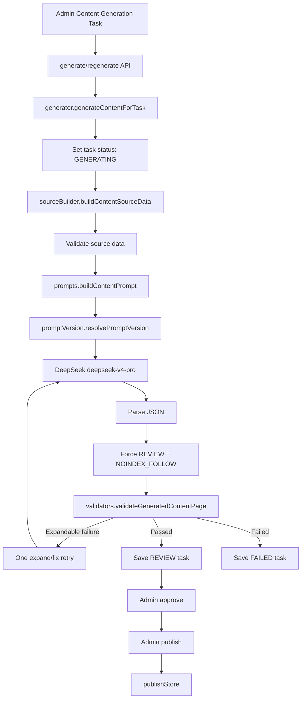
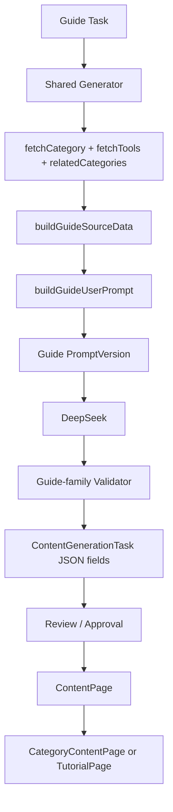
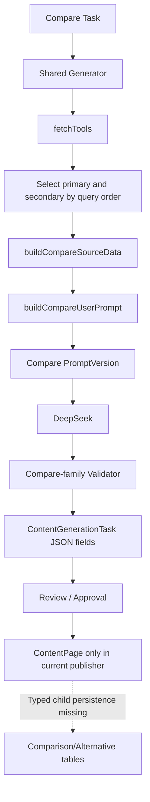
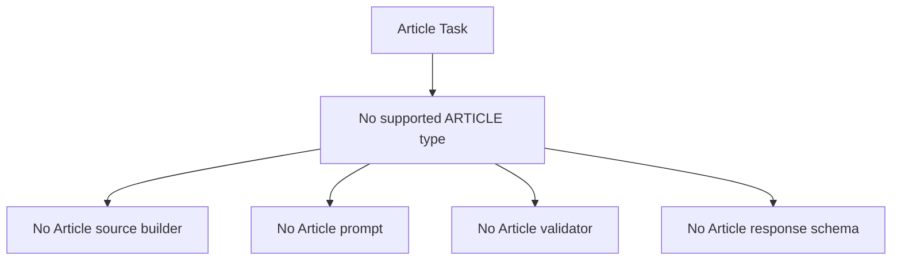
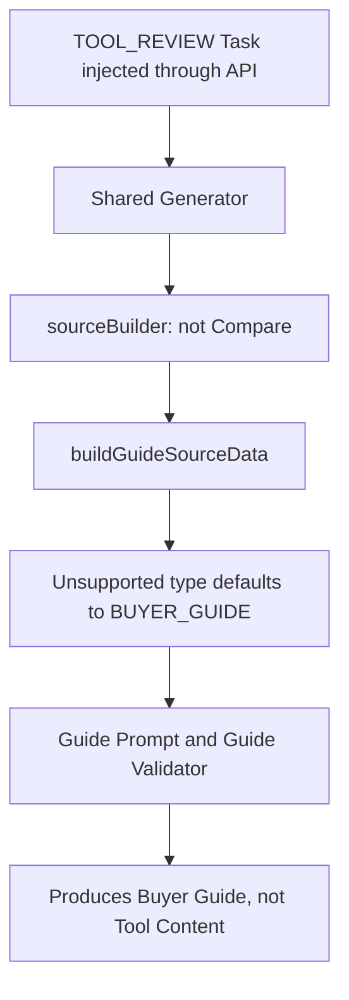
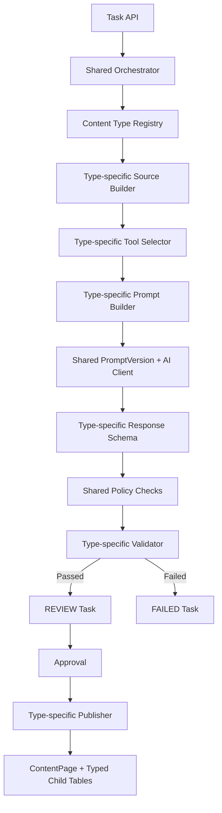

# Content Generation Architecture Analysis and Refactoring Design

## 0. Executive Summary

The current backend does not contain four independent generators for Guide, Compare, Article, and Tool Content. It contains one shared orchestration pipeline with two real generation families:

1. Guide family: `BUYER_GUIDE`, `CATEGORY_GUIDE`, and `TUTORIAL`.
2. Compare family: `COMPARISON` and `ALTERNATIVE`.

`ARTICLE` has no Prisma enum, source builder, prompt, validator, response schema, or publishing implementation. `TOOL_REVIEW` exists in the Prisma enum and task mapping, but has no dedicated generation path. If it reaches `sourceBuilder.js`, it is silently converted to `BUYER_GUIDE`.

Architecture rating: **B - partially shared**, with several **C-level coupling risks** inside the shared files. The orchestration and infrastructure are appropriately shared, but content-type policy, source construction, prompt construction, validation, and response schema dispatch are implemented through broad conditional branches rather than explicit generator modules.

## 1. Current Guide Generation Flow

Supported types:

- `BUYER_GUIDE`
- `CATEGORY_GUIDE`
- `TUTORIAL`

Flow:

1. Admin creates or edits a `ContentGenerationTask`.
2. `generate.post.js` or `regenerate.post.js` calls `generateContentForTask()`.
3. `generator.js` changes task status to `GENERATING`.
4. `sourceBuilder.js` loads category, related categories, and tools from Prisma.
5. `buildContentSourceData()` routes all non-compare types to `buildGuideSourceData()`.
6. `prompts.js` sees `sourceData.task === "generate_guide"` and calls `buildGuideUserPrompt()`.
7. `promptVersion.js` binds the task to `content-generation-guide-production@version`.
8. `generator.js` calls DeepSeek with the shared production model configuration.
9. The JSON response is parsed and forcibly normalized to `REVIEW` and `NOINDEX_FOLLOW`.
10. `validators.js` applies guide-family source, schema, depth, SEO, topic, FAQ, tool recommendation, and grounding checks.
11. A failed expandable check can trigger one expand/fix generation pass.
12. A valid result is saved as `REVIEW`; an invalid result is saved as `FAILED`.
13. Approval and publication are separate admin actions.
14. `publishStore.js` publishes `ContentPage` and writes `CategoryContentPage` or `TutorialPage` typed child data.

Important subtype behavior:

- `BUYER_GUIDE` requires category linkage and at least five source tools.
- `CATEGORY_GUIDE` uses the same prompt and depth limits as Buyer Guide.
- `TUTORIAL` also uses the same guide editorial rules and word-count contract, with only an additional `tutorialPage` output object.

There is no independent Tutorial prompt or validator policy.

## 2. Current Compare Generation Flow

Supported types:

- `COMPARISON`
- `ALTERNATIVE`

Flow:

1. Admin creates a task using `COMPARISON` or `ALTERNATIVE`.
2. The same `generateContentForTask()` orchestrator is called.
3. `sourceBuilder.js` routes these types to `buildCompareSourceData()`.
4. The first selected tool becomes `primaryTool`; the next distinct tool becomes `secondaryTool`.
5. `comparisonType` is inferred as `TOOL_VS_TOOL`, `MULTI_TOOL`, or `ALTERNATIVES`.
6. `prompts.js` calls `buildCompareUserPrompt()`.
7. `promptVersion.js` binds the task to `content-generation-compare-production@version`.
8. DeepSeek receives the compare prompt and compact tool context.
9. `validators.js` applies compare-family schema, word count, block count, matrix, criteria, verdict, FAQ, source, SEO, and grounding checks.
10. One expand/fix pass may run for expandable failures.
11. Valid output is saved as `REVIEW`; invalid output is saved as `FAILED`.

Publishing gap:

`publishStore.js` currently creates typed child records only for Guide/Category Guide and Tutorial. It does not write `ComparisonPage`, `ComparisonTool`, `AlternativePage`, or `AlternativeTool`, even though those Prisma models exist. Therefore the generation response schema and database publishing behavior are not fully aligned for Compare content.

## 3. Current Article Generation Flow

There is no current Article generator.

Evidence:

- `ContentPageType` has no `ARTICLE` value.
- The admin task form exposes only Buyer Guide, Category Guide, Tutorial, Comparison, and Alternative.
- `sourceBuilder.js` has no article source builder.
- `prompts.js` has no article prompt builder.
- `editorialRules.js` has no article rules.
- `validators.js` has no article validator.
- `publishStore.js` has no article-specific publishing branch.

If "Article" is being used informally to mean Guide content, it currently follows the Guide pipeline. It is not a distinct architecture or content contract.

If an unsupported type were injected through the API, `sourceBuilder.js` would normally route it to `buildGuideSourceData()`, which defaults unsupported values to `BUYER_GUIDE`. This is silent fallback behavior, not Article support.

## 4. Current Tool Content Generation Flow

There is no dedicated Tool Content generator.

`TOOL_REVIEW` exists in:

- Prisma `ContentPageType`.
- `taskStore.js` content-type mapping.
- `publishStore.js` accepted content type list.

However, it is absent from:

- The admin creation form.
- Source dispatch.
- Prompt dispatch.
- Editorial rules.
- Validator type sets.
- Dedicated response schema.
- Typed publishing logic.

Actual behavior if a `TOOL_REVIEW` task reaches generation:

1. `sourceBuilder.js` does not recognize it as Compare.
2. It enters `buildGuideSourceData()`.
3. The unsupported type is replaced with `BUYER_GUIDE`.
4. The generated content is therefore a Buyer Guide, not Tool Content.

This is a correctness risk because the persisted task type and generated `contentPage.type` can diverge conceptually, while the fallback hides the missing implementation.

## 5. Shared Prompt Builder

Yes, partially.

Shared entry point:

```text
buildContentPrompt(sourceData)
```

Dispatch:

```text
generate_compare -> buildCompareUserPrompt()
everything else  -> buildGuideUserPrompt()
```

Shared prompt infrastructure:

- One `editorialSystemPrompt`.
- One compact-tool implementation.
- One PromptVersion resolver.
- One expand/fix prompt builder.

Separate content prompts:

- Guide user prompt.
- Compare user prompt.

There are no Article or Tool Content prompt builders.

## 6. Shared Editorial Rules

Yes, partially.

`editorialRules.js` contains:

- Shared rules: factuality, output rules, SEO, safety, forbidden claims.
- Guide-specific rules and limits.
- Compare-specific rules and limits.

The Guide family shares one rule set across Buyer Guide, Category Guide, and Tutorial. The Compare family shares one rule set across Comparison and Alternative.

This is appropriate at the shared-policy level, but subtype-specific rules are underdeveloped. Tutorial and Alternative have materially different user intent and response structures yet inherit nearly all family rules.

## 7. Shared Validator

Yes.

All generated content is passed to:

```text
validateGeneratedContentPage(page, sourceData)
```

The validator determines the family from `contentPage.type` and applies conditional checks inside one large module.

Shared checks include:

- Base schema.
- Canonical path.
- REVIEW and NOINDEX state.
- SEO metadata.
- Source references.
- Forbidden claims.
- Pricing and feature grounding.

Family-specific checks include:

- Guide recommendation and framework counts.
- Compare matrix, criteria, and verdict checks.

Risk: schema validation, metric extraction, policy validation, and family-specific validation are concentrated in one file. Adding Article or Tool Content would increase condition-heavy coupling.

## 8. Shared Response Schema

No single formal response schema exists.

The system has two informal JSON shape examples embedded in `prompts.js`:

1. Guide-family shape:
   - `contentPage`
   - `bodyJson`
   - optional `tutorialPage`
   - optional `categoryContentPage`
   - `sources`
2. Compare-family shape:
   - `contentPage`
   - `bodyJson`
   - optional `comparisonPage` and `comparisonTools`
   - optional `alternativePage` and `alternativeTools`
   - `sources`

Shared envelope fields exist by convention, but there is no JSON Schema, Zod schema, Valibot schema, or Prisma-independent schema registry.

Consequences:

- Prompt examples and validator expectations can drift.
- Publish behavior can support fewer fields than generation produces.
- Article and Tool Content cannot be added safely through a single schema registration point.

## 9. File Responsibility Map

| Responsibility | Current file | Notes |
|---|---|---|
| API generation entry | `server/api/admin/content-generation/tasks/[id]/generate.post.js` | Calls shared generator |
| API regeneration entry | `server/api/admin/content-generation/tasks/[id]/regenerate.post.js` | Calls the same generator |
| Batch generation | `server/services/contentGeneration/batchQueue.js` | Shared queue with bounded concurrency |
| Orchestration | `server/services/contentGeneration/generator.js` | Status, AI call, retry, parsing, validation, persistence |
| Prompt dispatch | `server/services/contentGeneration/prompts.js` | Guide/Compare branching |
| System and user prompts | `server/services/contentGeneration/prompts.js` | Also contains compact source formatting |
| Editorial rules | `server/services/contentGeneration/editorialRules.js` | Shared, Guide, and Compare rules |
| Prompt version binding | `server/services/contentGeneration/promptVersion.js` | Chooses Guide/Compare version and fixed model config |
| Source construction | `server/services/contentGeneration/sourceBuilder.js` | Category/tool loading and source-data family dispatch |
| Tool selection | `server/services/contentGeneration/sourceBuilder.js` | `fetchTools()` query, ordering, filters, and limits |
| Tool compact context | `server/services/contentGeneration/prompts.js` | `compactTool()` and family source compaction |
| Source validation | `server/services/contentGeneration/validators.js` | Guide/Compare source checks |
| Output validation | `server/services/contentGeneration/validators.js` | Schema, metrics, policy, and family checks |
| Task persistence | `server/services/contentGeneration/taskStore.js` | Task state, JSON fields, events |
| Review workflow | `server/services/contentGeneration/reviewWorkflow.js` | Approve, reject, publish gate |
| Publishing | `server/services/contentGeneration/publishStore.js` | ContentPage, sources, Guide and Tutorial child rows |

## 10. Generation Flow Diagrams

### Shared Top-Level Flow



### Guide Family



### Compare Family



### Article



### Tool Content



## 11. Architecture Rating

### Overall: B - Partially Shared

Reasoning:

- Shared infrastructure is sensible: task state, API, model calling, retry, PromptVersion, review, and persistence.
- Guide and Compare have separate user prompts and separate rule sections.
- They still share one source module, one prompt module, one validator module, and one orchestration implementation.
- Dispatch is based on `if/else` and fallback behavior rather than an explicit type registry.
- Article and Tool Content are not implemented as generators.
- Response schema is implicit and publishing coverage is incomplete.

Coupling assessment by layer:

| Layer | Rating | Explanation |
|---|---|---|
| API and workflow | B | Correctly shared |
| AI client and retry | B | Correctly shared, but embedded in generator |
| Prompt construction | B/C | Two branches in one large file |
| Editorial policy | B | Shared base plus two family sections |
| Source construction | C | Querying, selection, mapping, and family dispatch are combined |
| Validation | C | Schema, metrics, grounding, and type-specific rules are combined |
| Response schema | C | Informal examples only |
| Publishing | C | Generation supports Compare structures that publisher does not persist |

## 12. Refactoring Recommendations

### 12.1 Keep Shared Infrastructure

Retain shared modules for:

- Task lifecycle.
- DeepSeek client.
- Retry policy.
- PromptVersion storage.
- Review and approval workflow.
- Common SEO and safety policies.
- Validation result format.

These are infrastructure concerns and should not be duplicated per content type.

### 12.2 Introduce a Generator Registry

Create an explicit registry keyed by `ContentPageType`:

```text
contentTypes/
  guide/
  tutorial/
  compare/
  alternative/
  article/
  toolReview/
```

Each generator definition should expose:

```js
{
  buildSourceData,
  buildPrompt,
  responseSchema,
  validate,
  publish,
  promptVersionName,
}
```

The orchestrator should reject unregistered types instead of converting them to Buyer Guide.

### 12.3 Split Content-Type Modules

Recommended structure:

```text
contentGeneration/
  core/
    generator.js
    aiClient.js
    retryPolicy.js
    promptVersion.js
    validationResult.js
  shared/
    editorialRules.js
    seoRules.js
    sourceRules.js
    toolContext.js
  types/
    buyerGuide/
      source.js
      prompt.js
      rules.js
      schema.js
      validator.js
      publisher.js
    categoryGuide/
    tutorial/
    comparison/
    alternative/
    article/
    toolReview/
  registry.js
```

Buyer Guide and Category Guide may share a base module, but Tutorial should have its own depth and response requirements. Comparison and Alternative may share comparison utilities while retaining separate schemas.

### 12.4 Add Formal Response Schemas

Define executable schemas for:

- Common content envelope.
- Buyer Guide.
- Category Guide.
- Tutorial.
- Comparison.
- Alternative.
- Article.
- Tool Review.

Use a structured schema library or JSON Schema. Generate the prompt shape reference from the schema rather than manually maintaining examples.

Benefits:

- Prompt and validator cannot drift independently.
- Parse errors become precise field errors.
- Publishing receives a known typed object.
- Article and Tool Review can be added without extending one large validator.

### 12.5 Separate Tool Selection From Source Mapping

Current `sourceBuilder.js` combines:

- Prisma queries.
- Ranking and selection.
- Tool mapping.
- Source collection.
- Family source construction.

Split into:

- `toolRepository.js`: database retrieval.
- `toolSelector.js`: selection strategy per content type.
- `toolContextMapper.js`: compact factual context.
- Per-type source builders.

Compare tasks should explicitly identify primary and secondary tool IDs rather than relying on query order. Tool Review should require one explicit `toolId`.

### 12.6 Implement Article Explicitly

First decide what Article means. Suggested contract:

- Add a supported content type only if it is semantically distinct from Guide.
- Define article intent, source strategy, word limits, required sections, response schema, and publishing route.
- Do not use `targetType` as an unvalidated substitute for `contentType`.

If Article is only a UI label for Guide, remove the architectural ambiguity and document that mapping instead of creating another generator.

### 12.7 Implement Tool Content Explicitly

For `TOOL_REVIEW`:

- Require `toolId`.
- Load one primary tool with pricing, claims, sources, integrations, pros, cons, and use cases.
- Create a dedicated tool-review prompt.
- Define sections such as overview, features, use cases, pricing context, pros/cons, limitations, alternatives, verdict, FAQ, and methodology.
- Add a dedicated schema and validator.
- Add typed publishing support if a Tool Review child table is required, or document that it is intentionally stored only in `ContentPage`.

### 12.8 Align Publishing With Generation

Add publishing adapters for the structures already generated:

- `ComparisonPage`
- `ComparisonTool`
- `AlternativePage`
- `AlternativeTool`

Generation support should not be considered complete until the corresponding structured records are persisted.

### 12.9 Remove Silent Fallbacks

Replace this behavior:

```text
unsupported content type -> BUYER_GUIDE
```

with:

```text
unsupported content type -> explicit 400/422 error
```

Silent fallback makes architecture gaps appear as successful content generation and can publish the wrong content type.

### 12.10 Refactoring Priority

1. Reject unsupported content types instead of defaulting to Buyer Guide.
2. Fix Compare/Alternative typed publishing.
3. Introduce formal response schemas.
4. Introduce the generator registry.
5. Split validator and source builder by content type.
6. Implement Tool Review explicitly.
7. Define and implement Article only after its product intent is agreed.

## 13. Target Architecture



This design preserves useful shared infrastructure while making each content type explicit, testable, and independently evolvable.
